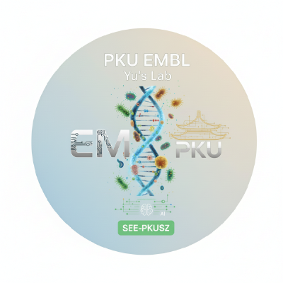

# 环境生物信息学方法

<p class="page-lead">Methodologies of Environmental Bioinformatics · 面向研究生的研究型方法课程</p>

::::{grid} 1 1 2 2
:gutter: 4
:class-container: course-hero

:::{grid-item}
:class: course-hero__main

<span class="course-kicker">Environmental Bioinformatics · 2026</span>

## 从环境问题到可复现证据

课程以真实环境微生物组研究为主线，连接序列数据库、同源性搜索、宏基因组组装、分箱、基因组质量控制、系统发育、功能注释、宏转录组与群落生态分析。你将学习的不只是“如何运行工具”，而是如何判断一条分析证据链是否可靠。

<div class="course-actions">

[查看教学进度](schedule.md){.course-button .course-button--primary}
[准备课程汇报](project.md){.course-button}

</div>
:::

:::{grid-item}
:class: course-hero__aside

<div class="course-lab-brand">
  
  <p><strong>PKU EMBL · Yu’s Lab</strong><br><span>Environmental Microbiology &amp; Bioinformatics</span></p>
</div>

**课程概览**

- **授课教师：** 余珂 / Ke Yu
- **修读对象：** 硕士、博士研究生
- **教学方式：** 讲授、案例拆解、方法讨论
- **主线材料：** 10 讲课程课件
- **考核方式：** 课程汇报一项

:::
::::

::::{grid} 1 3 3 3
:gutter: 3

:::{grid-item-card} 10 个教学单元
:class-card: course-stat
从生物学基础逐步进入宏基因组、宏转录组与群落生态。
:::

:::{grid-item-card} 1 条证据主线
:class-card: course-stat
问题定义 → 数据 → 方法 → 质量控制 → 解释与边界。
:::

:::{grid-item-card} 1 项课程考核
:class-card: course-stat
以可复现、可答辩的课程汇报整合学习成果。
:::
::::

## 课程导航

::::{grid} 1 2 2 2
:gutter: 3

:::{grid-item-card} 课程大纲 · Syllabus
:class-card: course-card
理解课程定位、能力目标、先修要求、知识主线与评价标准。
+++
[进入课程大纲](syllabus.md)
:::

:::{grid-item-card} 教学进度 · Schedule
:class-card: course-card
按课件定位每讲的核心问题、方法概念、课前准备与讲义入口。
+++
[进入教学进度](schedule.md)
:::

:::{grid-item-card} 课程汇报 · Presentation
:class-card: course-card
从选题、证据设计、图表叙事到评分标准，完成最终学术汇报。
+++
[查看汇报指南](project.md)
:::

:::{grid-item-card} 方法训练 · Practice
:class-card: course-card
围绕 BLAST、宏基因组流程、MAG 质量与生态解释进行低风险训练。
+++
[查看训练任务](assignments.md)
:::

:::{grid-item-card} 学术规范 · Policies
:class-card: course-card
明确可复现性、学术诚信、AI 工具披露与课堂表达的最低要求。
+++
[查看课程规范](policies.md)
:::

:::{grid-item-card} 资源索引 · Resources
:class-card: course-card
集中查找课程课件、数据资源、常用工具与可复现工作流组件。
+++
[打开资源索引](resources.md)
:::
::::

## 学习路径

| 阶段 | 核心问题 | 对应内容 | 阶段产出 |
| --- | --- | --- | --- |
| **建立语言** | 生物学问题如何转化为序列与数据库问题？ | L1–L3 | 能解释数据库选择、比对指标和同源性证据 |
| **构建对象** | 如何从环境测序数据恢复 contig 与 MAG？ | L4–L8 | 能画出组装—分箱—质量评估的完整决策链 |
| **连接功能** | 丰度、注释与表达证据分别说明什么？ | L9 | 能区分“存在”“潜能”“活性”三类结论 |
| **回到生态** | 如何把组学结果放回群落构建与生态过程？ | L10 | 能给出克制、可验证的生态解释 |
| **形成论证** | 如何把复杂流程压缩成可答辩的证据故事？ | 课程汇报 | 一场结构清楚、方法透明、边界明确的汇报 |

## 核心方法论

> 环境生物信息学的价值，不在于运行更多软件，而在于把环境生物学问题转化为一条可检验、可追溯、可解释的计算证据链。

::::{grid} 1 3 3 3
:gutter: 3

:::{grid-item}
:class: course-route
**01 · Problem**

先定义研究对象、尺度与可证伪的问题，再决定需要什么数据。
:::

:::{grid-item}
:class: course-route
**02 · Evidence**

让每个工具选择、参数和质量阈值都服务于同一条论证主线。
:::

:::{grid-item}
:class: course-route
**03 · Interpretation**

把结果、局限性和替代解释放在一起，避免把软件输出等同于事实。
:::
::::

```{admonition} 文档边界
:class: note
本站是课程学习与方法训练入口。课堂安排、汇报时长和具体组织方式如有调整，以任课教师的最新说明为准；涉及数据库、软件和外部资源时，请同时核对其官方文档与版本信息。
```

```{toctree}
:maxdepth: 2
:caption: 课程导航
:hidden:

syllabus
schedule
project
assignments
policies
resources
faq
```
